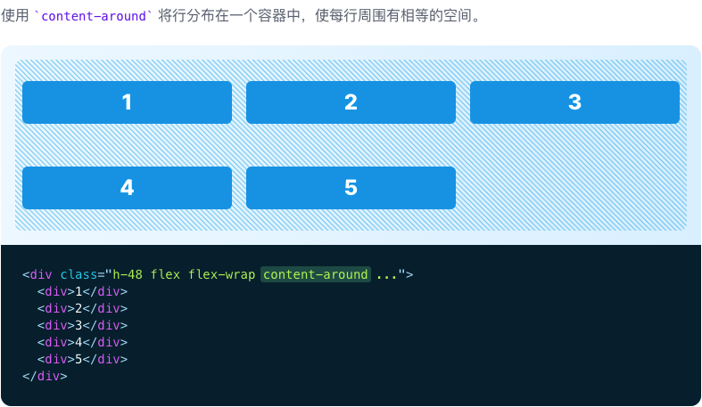

# Align Content

::: tip
用于控制在多行 flex 和网格容器中行的位置的功能类。
:::

| Class | Properties |
| :------ | :------ |
| content-center | align-content: center; |
| content-start | align-content: flex-start; |
| content-end | align-content: flex-end; |
| content-between | align-content: space-between; |
| content-around | align-content: space-around; |
| content-evenly | align-content: space-evenly; |

***Start***

***Center***

***End***

***Space between***

***Space around***

