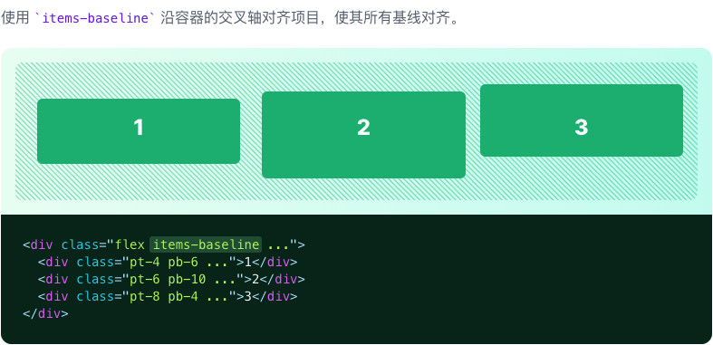

# Align Items

::: tip
用于控制 Flex 和网格项如何沿着容器的横轴定位的功能类。
:::

| Class | Properties |
| :------ | :------ |
| items-start | align-items: flex-start; |
| items-end | align-items: flex-end; |
| items-center | align-items: center; |
| items-baseline | align-items: baseline; |
| items-stretch | align-items: stretch; |

***Stretch***

***Start***

***Center***

***End***

***Baseline***

