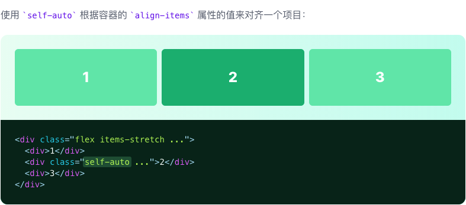
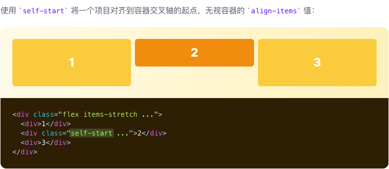
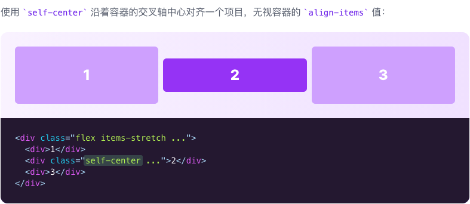
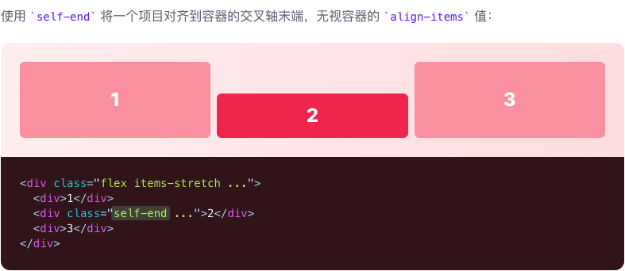
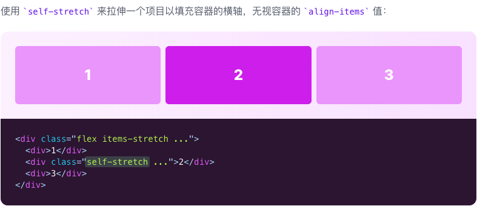

# Align Self

::: tip
用于控制单个 flex 或网格项如何沿其容器的交叉轴定位的功能类。
:::

| Class | Properties |
| :------ | :------ |
| self-auto | align-self: auto; |
| self-start | align-self: flex-start; |
| self-end | align-self: flex-end; |
| self-center | align-self: center; |
| self-stretch | align-self: stretch; |

***Auto***

***Start***

***Center***

***End***

***Stretch***

