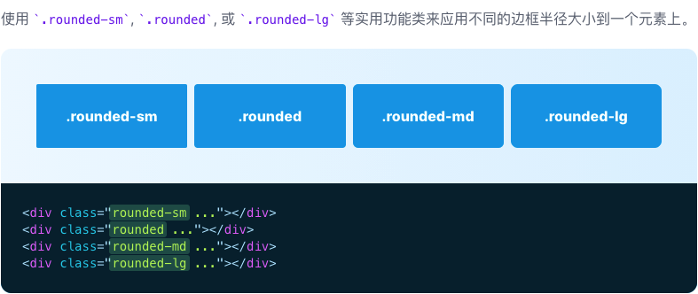
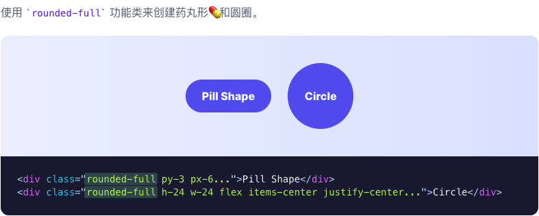
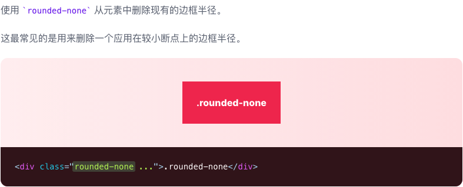
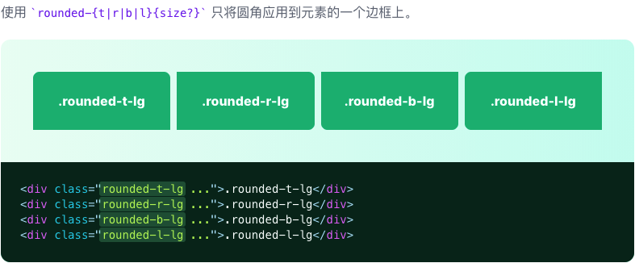
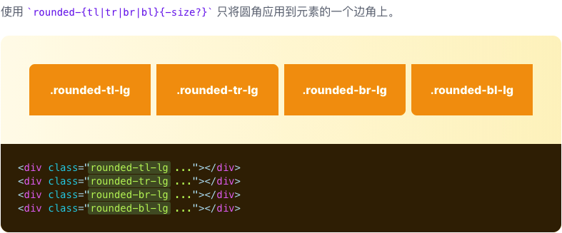

# 边框圆角

> 边框圆角

| Class | Properties |
| :------ | :------ |
| .rounded-none | border-radius: 0px; |
| .rounded-sm | border-radius: 3cpx; |
| .rounded | border-radius: 5cpx; |
| .rounded-md | border-radius: 7cpx; |
| .rounded-lg | border-radius: 10cpx; |
| .rounded-xl | border-radius: 20cpx; |
| .rounded-2xl | border-radius: 50cpx; |
| .rounded-3xl | border-radius: 75cpx; |
| .rounded-full | border-radius: 9999cpx; |
| .rounded-t-none | border-top-left-radius: 0px; border-top-right-radius: 0px; |
| .rounded-r-none | border-top-right-radius: 0px; border-bottom-right-radius: 0px; |
| .rounded-b-none | border-bottom-right-radius: 0px; border-bottom-left-radius: 0px; |
| .rounded-l-none | border-top-left-radius: 0px; border-bottom-left-radius: 0px; |
| .rounded-t-sm | border-top-left-radius: 3cpx; border-top-right-radius: 3cpx; |
| .rounded-r-sm | border-top-right-radius: 3cpx; border-bottom-right-radius: 3cpx; |
| .rounded-b-sm | border-bottom-right-radius: 3cpx; border-bottom-left-radius: 3cpx; |
| .rounded-l-sm | border-top-left-radius: 3cpx; border-bottom-left-radius: 3cpx; |
| .rounded-t | border-top-left-radius: 5cpx; border-top-right-radius: 5cpx; |
| .rounded-r | border-top-right-radius: 5cpx; border-bottom-right-radius: 5cpx; |
| .rounded-b | border-bottom-right-radius: 5cpx; border-bottom-left-radius: 5cpx; |
| .rounded-l | border-top-left-radius: 5cpx; border-bottom-left-radius: 5cpx; |
| .rounded-t-md | border-top-left-radius: 7cpx; border-top-right-radius: 7cpx; |
| .rounded-r-md | border-top-right-radius: 7cpx; border-bottom-left-radius: 7cpx; |
| .rounded-b-md | border-bottom-right-radius: 7cpx; border-bottom-left-radius: 7cpx; |
| .rounded-l-md | border-top-left-radius: 7cpx; border-bottom-left-radius: 7cpx; |
| .rounded-t-lg | border-top-left-radius: 10cpx; border-top-right-radius: 10cpx; |
| .rounded-r-lg | border-top-right-radius: 10cpx; border-bottom-left-radius: 10cpx; |
| .rounded-b-lg | border-bottom-right-radius: 10cpx; border-bottom-left-radius: 10cpx; |
| .rounded-l-lg | border-top-left-radius: 10cpx; border-bottom-left-radius: 10cpx; |
| .rounded-t-xl | border-top-left-radius: 20cpx; border-top-right-radius: 20cpx; |
| .rounded-r-xl | border-top-right-radius: 20cpx; border-bottom-left-radius: 20cpx; |
| .rounded-b-xl | border-bottom-right-radius: 20cpx; border-bottom-left-radius: 20cpx; |
| .rounded-l-xl | border-top-left-radius: 20cpx; border-bottom-left-radius: 20cpx; |
| .rounded-t-2xl | border-top-left-radius: 50cpx; border-top-right-radius: 50cpx; |
| .rounded-r-2xl | border-top-right-radius: 50cpx; border-bottom-left-radius: 50cpx; |
| .rounded-b-2xl | border-bottom-right-radius: 50cpx; border-bottom-left-radius: 50cpx; |
| .rounded-l-2xl | border-top-left-radius: 50cpx; border-bottom-left-radius: 50cpx; |
| .rounded-t-3xl | border-top-left-radius: 75cpx; border-top-right-radius: 75cpx; |
| .rounded-r-3xl | border-top-right-radius: 75cpx; border-bottom-left-radius: 75cpx; |
| .rounded-b-3xl | border-bottom-right-radius: 75cpx; border-bottom-left-radius: 75cpx; |
| .rounded-l-3xl | border-top-left-radius: 75cpx; border-bottom-left-radius: 75cpx; |
| .rounded-t-full | border-top-left-radius: 9999cpx; border-top-right-radius: 9999cpx; |
| .rounded-r-full | border-top-right-radius: 9999cpx; border-bottom-left-radius: 9999cpx; |
| .rounded-b-full | border-bottom-right-radius: 9999cpx; border-bottom-left-radius: 9999cpx; |
| .rounded-l-full | border-top-left-radius: 9999cpx; border-bottom-left-radius: 9999cpx; |
| .rounded-tl-none | border-top-left-radius: 0px; |
| .rounded-tr-none | border-top-right-radius: 0px; |
| .rounded-br-none | border-bottom-right-radius: 0px; |
| .rounded-bl-none | border-bottom-left-radius: 0px; |
| .rounded-tl-sm | border-top-left-radius: 3cpx; |
| .rounded-tr-sm | border-top-right-radius: 3cpx; |
| .rounded-br-sm | border-bottom-right-radius: 3cpx; |
| .rounded-bl-sm | border-bottom-left-radius: 3cpx; |
| .rounded-tl | border-top-left-radius: 5cpx; |
| .rounded-tr | border-top-right-radius: 5cpx; |
| .rounded-br | border-bottom-right-radius: 5cpx; |
| .rounded-bl | border-bottom-left-radius: 5cpx; |
| .rounded-tl-md | border-top-left-radius: 7cpx; |
| .rounded-tr-md | border-top-right-radius: 7cpx; |
| .rounded-br-md | border-bottom-right-radius: 7cpx; |
| .rounded-bl-md | border-bottom-left-radius: 7cpx; |
| .rounded-tl-lg | border-top-left-radius: 10cpx; |
| .rounded-tr-lg | border-top-right-radius: 10cpx; |
| .rounded-br-lg | border-bottom-right-radius: 10cpx; |
| .rounded-bl-lg | border-bottom-left-radius: 10cpx; |
| .rounded-tl-xl | border-top-left-radius: 20cpx; |
| .rounded-tr-xl | border-top-right-radius: 20cpx; |
| .rounded-br-xl | border-bottom-right-radius: 20cpx; |
| .rounded-bl-xl | border-bottom-left-radius: 20cpx; |
| .rounded-tl-2xl | border-top-left-radius: 50cpx; |
| .rounded-tr-2xl | border-top-right-radius: 50cpx; |
| .rounded-br-2xl | border-bottom-right-radius: 50cpx; |
| .rounded-bl-2xl | border-bottom-left-radius: 50cpx; |
| .rounded-tl-3xl | border-top-left-radius: 75cpx; |
| .rounded-tr-3xl | border-top-right-radius: 75cpx; |
| .rounded-br-3xl | border-bottom-right-radius: 75cpx; |
| .rounded-bl-3xl | border-bottom-left-radius: 75cpx; |
| .rounded-tl-full | border-top-left-radius: 9999cpx; |
| .rounded-tr-full | border-top-right-radius: 9999cpx; |
| .rounded-br-full | border-bottom-right-radius: 9999cpx; |
| .rounded-bl-full | border-bottom-left-radius: 9999cpx; |

***圆角***

***药丸形💊和圆圈***

***无圆角***

***独立设置每条边框的圆角效果***

***独立设置每个边角的圆角效果***

