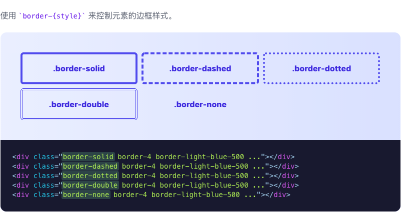

# 边框样式

> 用于控制元素边框样式的功能类。

| Class | Properties |
| :------ | :------ |
| .border-solid | border-style: solid; |
| .border-dashed | border-style: dashed; |
| .border-dotted | border-style: dotted; |
| .border-double | border-style: double; |
| .border-none | border-style: none; |

***使用***

