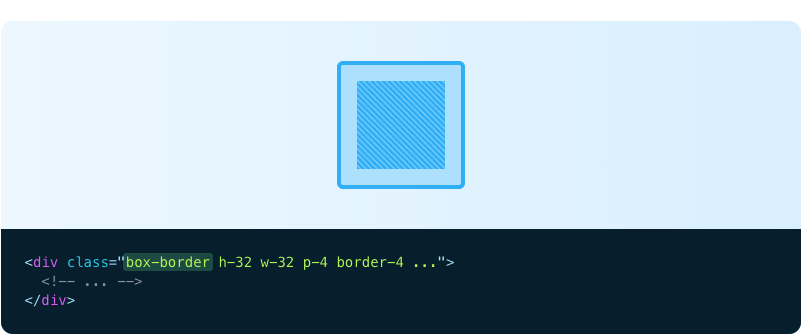
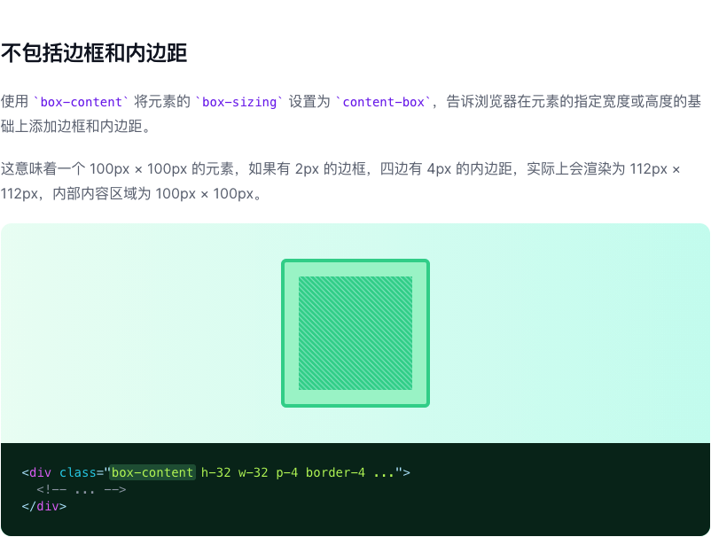

# Box Sizing

> 控制浏览器如何计算元素的总大小的功能类。

| Class | Properties |
| :------ | :------ |
| .box-border | box-sizing: border-box; |
| .box-content | box-sizing: content-box; |

***包括边框和内边距***

使用 box-border 将元素的 box-sizing 设置为 border-box，告诉浏览器，当您给它一个高度或宽度时，它将包括元素的边框和内边距。

这意味着一个 100px × 100px 的元素，边框为 2px，四边有 4px 的内边距，将渲染为 100px × 100px，内部内容区域为 88px × 88px。

