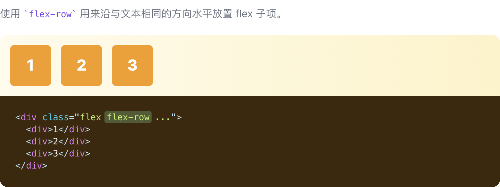
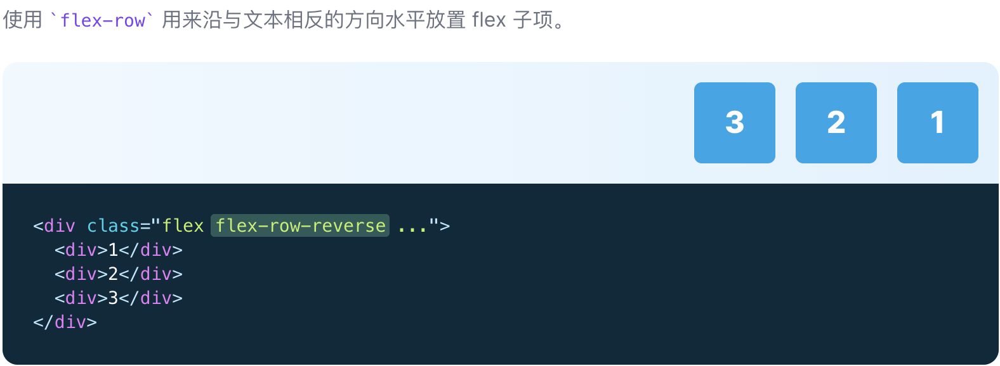
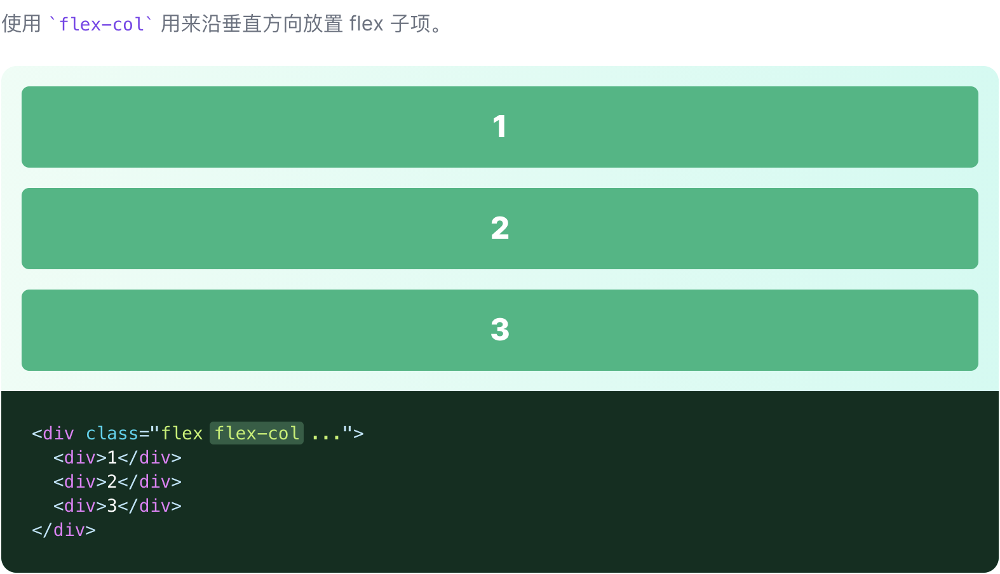
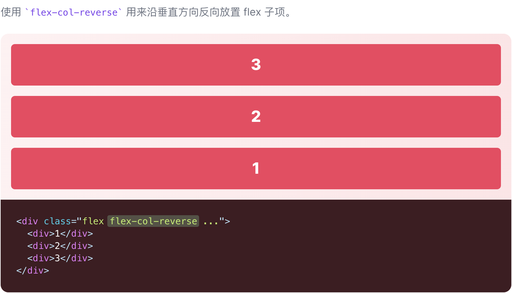

# Flex Direction

::: tip
控制 Flex 子项的方向的功能类
:::

| Class | Properties |
| :------ | :------ |
| flex-row | flex-direction: row; |
| flex-row-reverse | flex-direction: row-reverse; |
| flex-col | flex-direction: column; |
| flex-col-reverse | flex-direction: column-reverse; |

***横向***

***横向反向***

***纵向***

***纵向反向***

