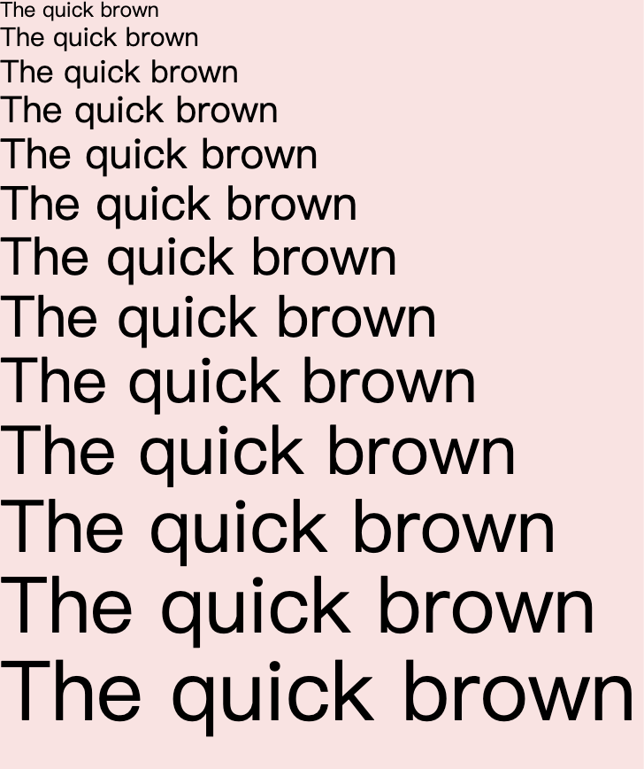

# 字体大小

| Class | Properties |
| :------ | :------ |
| .text-xs | font-size: 24cpx;line-height: 30cpx; |
| .text-sm | font-size: 30cpx;line-height: 36cpx; |
| .text-base | font-size: 36cpx;line-height: 42cpx; |
| .text-lg | font-size: 42cpx;line-height: 48cpx; |
| .text-xl | font-size: 48cpx;line-height: 54cpx; |
| .text-2xl | font-size: 54cpx;line-height: 60cpx; |
| .text-3xl | font-size: 60cpx;line-height: 66cpx; |
| .text-4xl | font-size: 66cpx;line-height: 72cpx; |
| .text-5xl | font-size: 72cpx;line-height: 78cpx; |
| .text-6xl | font-size: 78cpx;line-height: 84cpx; |
| .text-7xl | font-size: 84cpx;line-height: 90cpx; |
| .text-8xl | font-size: 90cpx;line-height: 96cpx; |
| .text-9xl | font-size: 96cpx;line-height: 102cpx; |




```html
  <text class="text-xs">The quick brown</text>
  <text class="text-sm">The quick brown</text>
  <text class="text-base">The quick brown</text>
  <text class="text-lg">The quick brown</text>
  <text class="text-xl">The quick brown</text>
  <text class="text-2xl">The quick brown</text>
  <text class="text-3xl">The quick brown</text>
  <text class="text-4xl">The quick brown</text>
  <text class="text-5xl">The quick brown</text>
  <text class="text-6xl">The quick brown</text>
  <text class="text-7xl">The quick brown</text>
  <text class="text-8xl">The quick brown</text>
  <text class="text-9xl">The quick brown</text>
```
