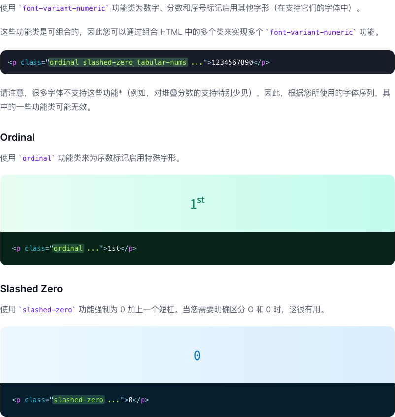
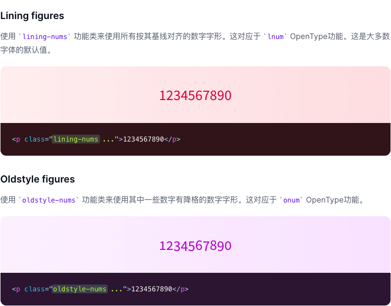
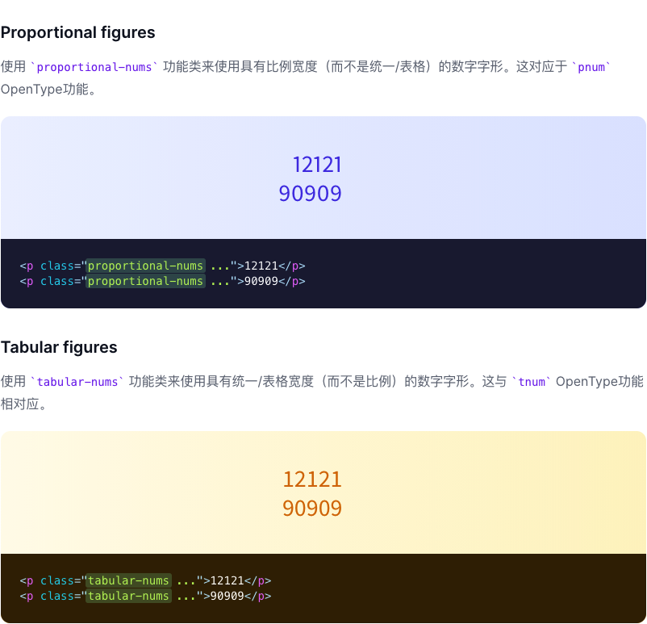
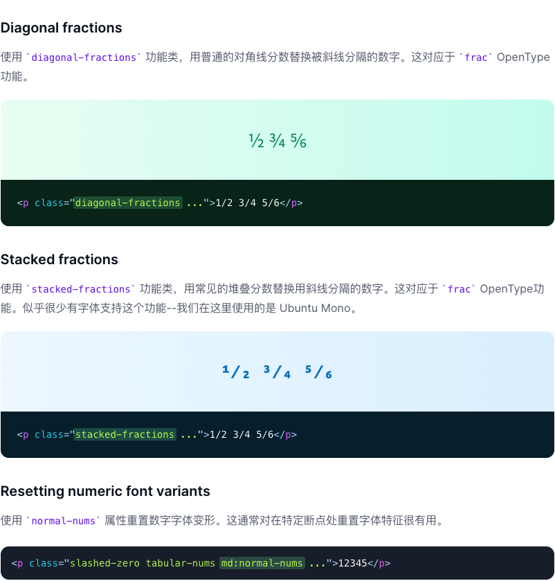

# Font Variant Numeric

> 用来控制数字变形的功能类

| Class | Properties |
| :------ | :------ |
| .normal-nums | font-variant-numeric: normal; |
| .ordinal | font-variant-numeric: ordinal; |
| .slashed-zero | font-variant-numeric: slashed-zero; |
| .lining-nums | font-variant-numeric: lining-nums; |
| .oldstyle-nums | font-variant-numeric: oldstyle-nums; |
| .proportional-nums | font-variant-numeric: proportional-nums; |
| .tabular-nums | font-variant-numeric: tabular-nums; |
| .diagonal-fractions | font-variant-numeric: diagonal-fractions; |
| .stacked-fractions | font-variant-numeric: stacked-fractions; |

***使用方法***

