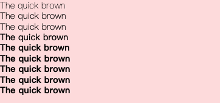

# 字体粗细

| Class | Properties |
| :------ | :------ |
| .font-thin | font-weight: 100; |
| .font-extralight | font-weight: 200; |
| .font-light | font-weight: 300; |
| .font-normal | font-weight: 400; |
| .font-medium | font-weight: 500; |
| .font-semibold | font-weight: 600; |
| .font-bold | font-weight: 700; |
| .font-extrabold | font-weight: 800; |
| .font-black | font-weight: 900; |




```html
  <text class="text-sm font-thin">The quick brown</text>
  <text class="text-sm font-extralight">The quick brown</text>
  <text class="text-sm font-light">The quick brown</text>
  <text class="text-sm font-normal">The quick brown</text>
  <text class="text-sm font-medium">The quick brown</text>
  <text class="text-sm font-semibold">The quick brown</text>
  <text class="text-sm font-bold">The quick brown</text>
  <text class="text-sm font-extrabold">The quick brown</text>
  <text class="text-sm font-black">The quick brown</text>
```
