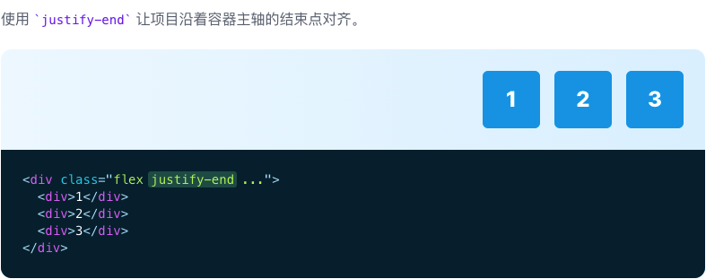

# Justify Content

::: tip
用于控制 flex 和 grid 项目如何沿着容器的主轴定位的功能类。
:::

| Class | Properties |
| :------ | :------ |
| justify-start | justify-content: flex-start; |
| justify-end | justify-content: flex-end; |
| justify-center | justify-content: center; |
| justify-between | justify-content: space-between; |
| justify-around | justify-content: space-around; |
| justify-evenly | justify-content: space-evenly; |

***Start***

***Center***

***End***

***Space between***

***Space around***

***Space evenly***

