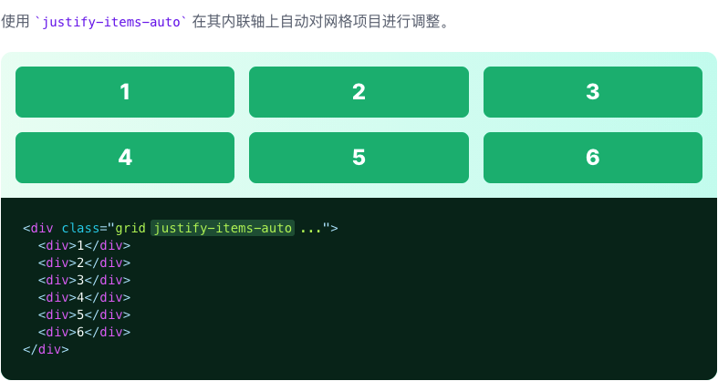
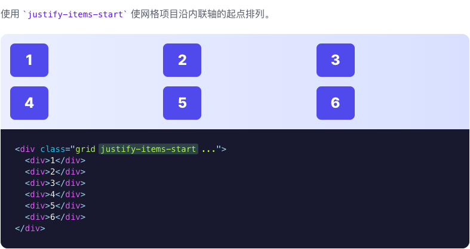
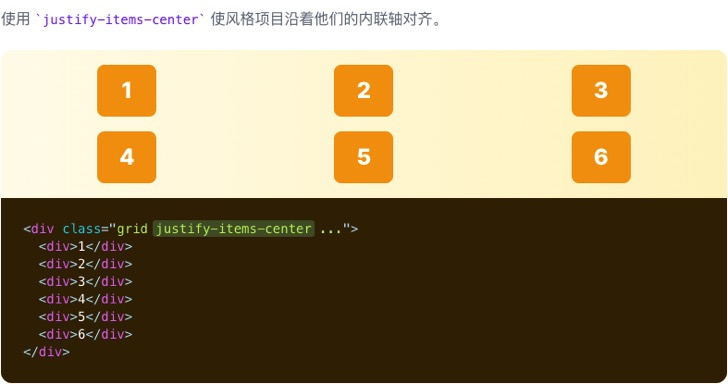
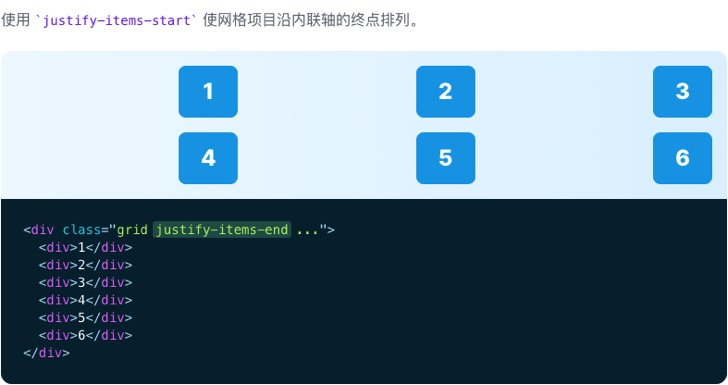
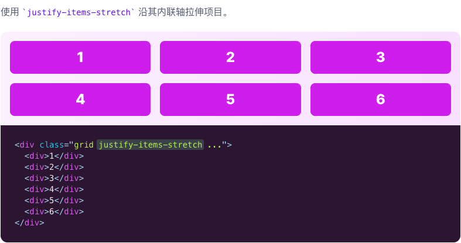

# Justify Items

::: tip
用于控制网格项目如何沿其内联轴对齐的功能类。
:::

| Class | Properties |
| :------ | :------ |
| justify-items-auto | justify-items: auto; |
| justify-items-start | justify-items: start; |
| justify-items-end | justify-items: end; |
| justify-items-center | justify-items: center; |
| justify-items-stretch | justify-items: stretch; |

***Auto***

***Start***

***Center***

***End***

***Stretch***

