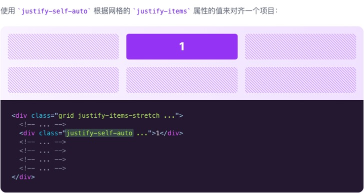
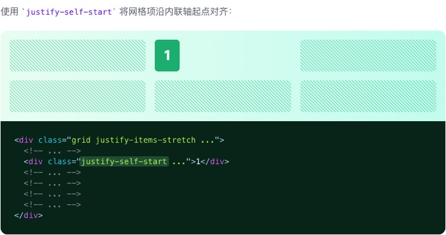
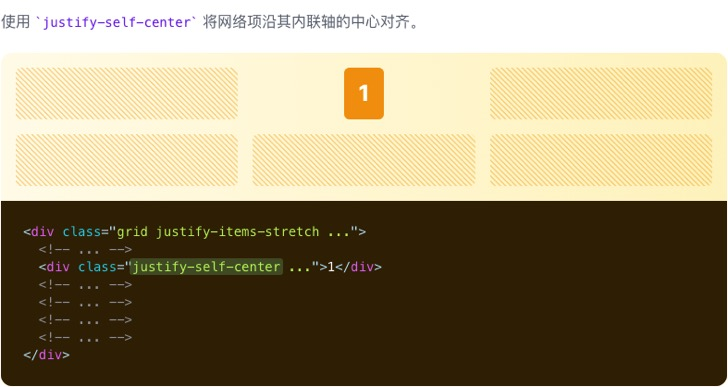
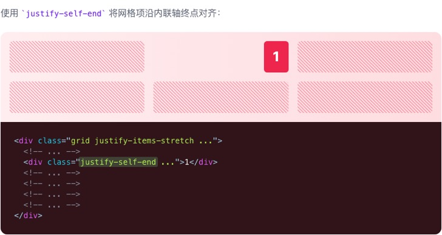
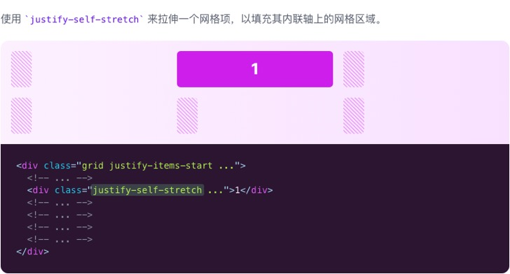

# Justify Self

::: tip
用于控制单个网格项如何沿其内联轴对齐的功能类。
:::

| Class | Properties |
| :------ | :------ |
| justify-self-auto | justify-self: auto; |
| justify-self-start | justify-self: start; |
| justify-self-end | justify-self: end; |
| justify-self-center | justify-self: center; |
| justify-self-stretch | justify-self: stretch; |

***Auto***

***Start***

***Center***

***End***

***Stretch***

