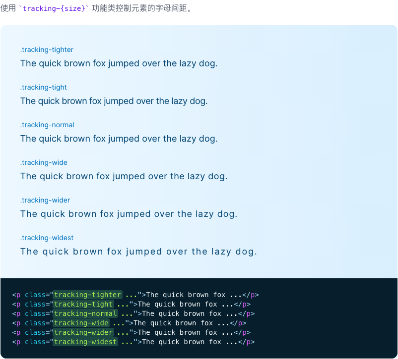

# 字母间距

::: tip
用于控制元素的字距（字母间距）的功能类。
:::

| Class | Properties |
| :------ | :------ |
| .tracking-tighter | letter-spacing: -2cpx; |
| .tracking-tight | letter-spacing: -1cpx; |
| .tracking-normal | letter-spacing: 0cpx; |
| .tracking-wide | letter-spacing: 1cpx; |
| .tracking-wider | letter-spacing: 2cpx; |
| .tracking-widest | letter-spacing: 3cpx; |

***用法***

