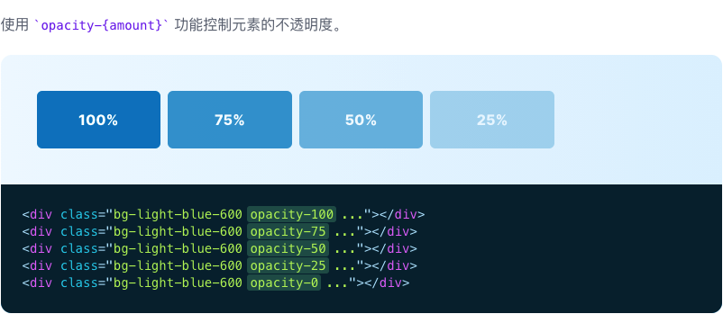

# 不透明度

> 用于控制元素不透明度的功能类。

| Class | Properties |
| :------ | :------ |
| .opacity-0 | opacity: 0; |
| .opacity-5 | opacity: 0.05; |
| .opacity-10 | opacity: 0.1; |
| .opacity-20 | opacity: 0.2; |
| .opacity-25 | opacity: 0.25; |
| .opacity-30 | opacity: 0.3; |
| .opacity-40 | opacity: 0.4; |
| .opacity-50 | opacity: 0.5; |
| .opacity-60 | opacity: 0.6; |
| .opacity-70 | opacity: 0.7; |
| .opacity-75 | opacity: 0.75; |
| .opacity-80 | opacity: 0.8; |
| .opacity-90 | opacity: 0.9; |
| .opacity-95 | opacity: 0.95; |
| .opacity-100 | opacity: 1; |

***使用***

