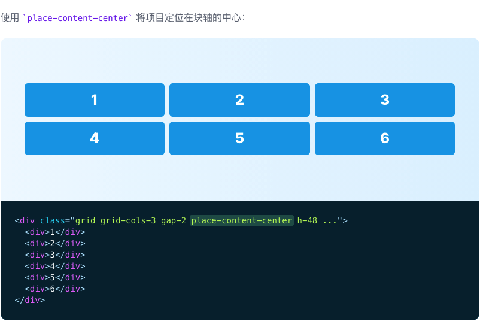
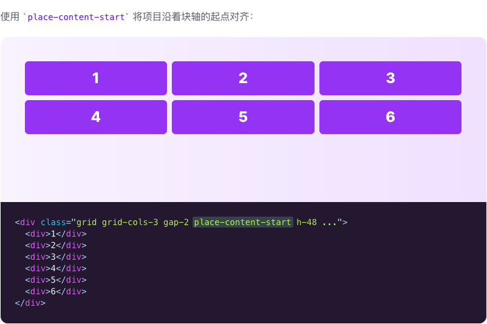
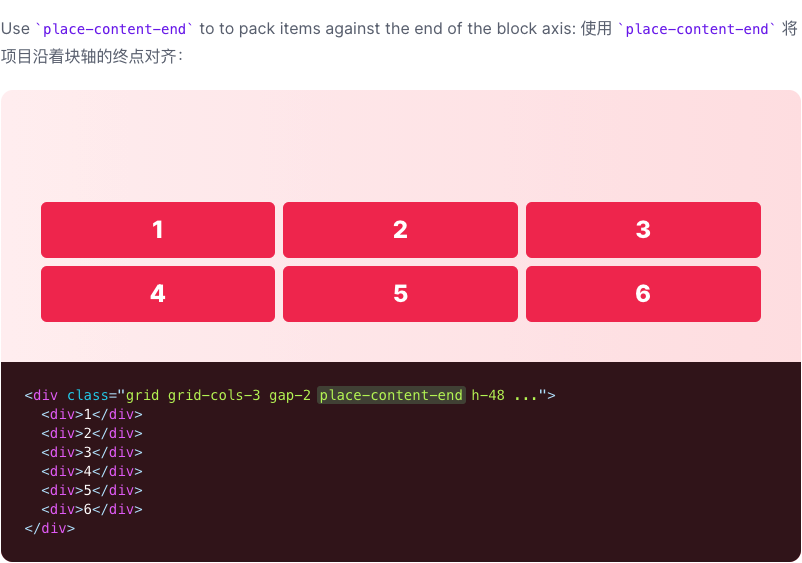
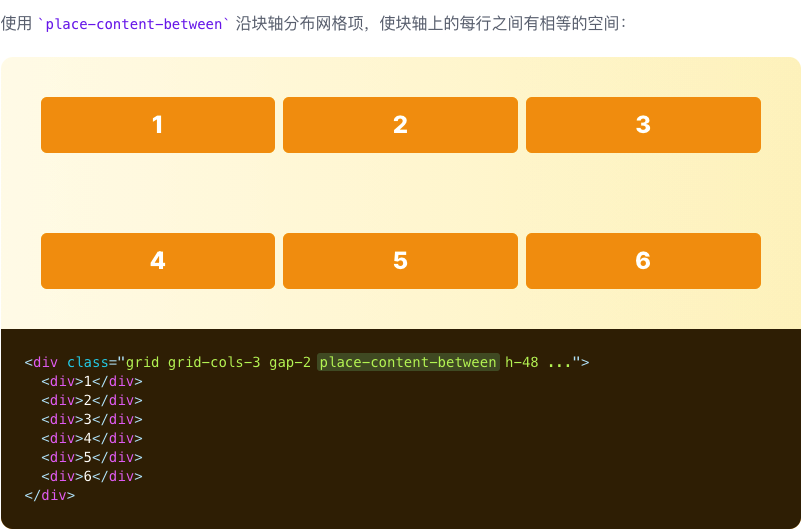
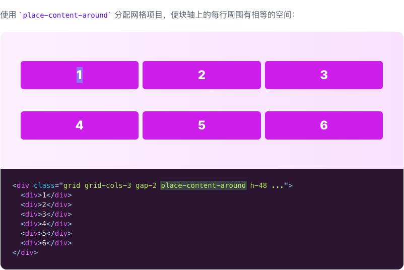
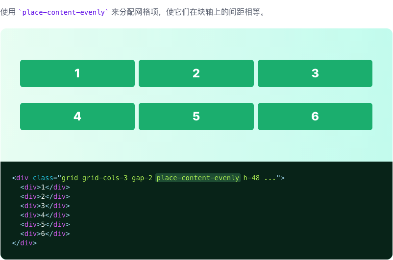
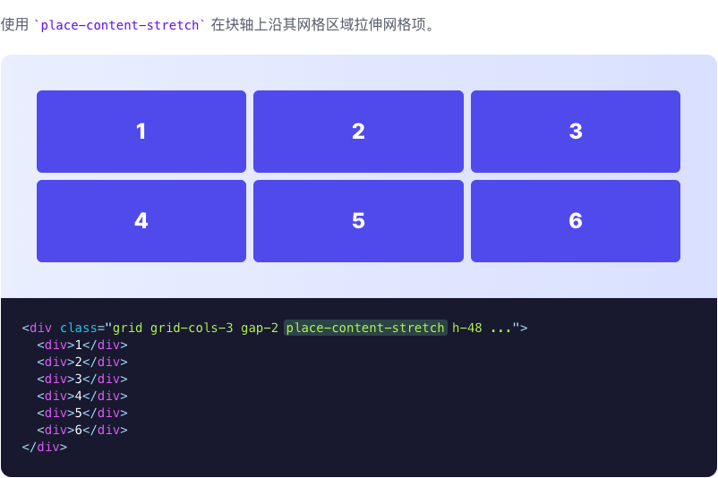

# Place Content

::: tip
用于同时控制内容如何在水平和垂直方向上对齐的功能类
:::

| Class | Properties |
| :------ | :------ |
| place-content-center | place-content: center; |
| place-content-start | place-content: start; |
| place-content-end | place-content: end; |
| place-content-between | place-content: space-between; |
| place-content-around | place-content: space-around; |
| place-content-evenly | place-content: space-evenly; |
| place-content-stretch | place-content: stretch; |

***Center***

***Start***

***End***

***Space between***

***Space around***

***Space evenly***

***Stretch***

