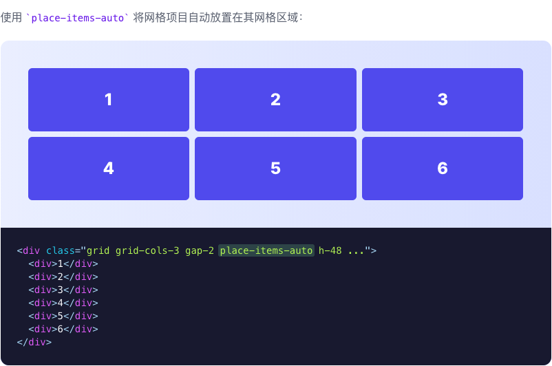
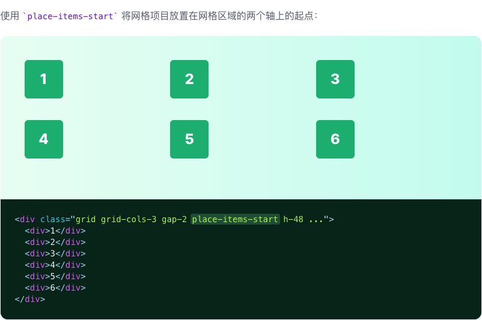
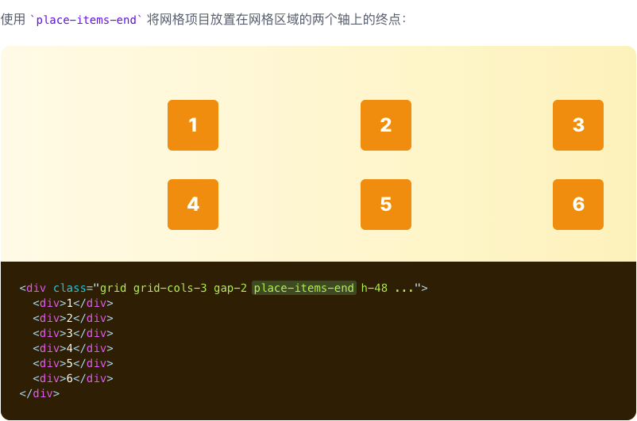
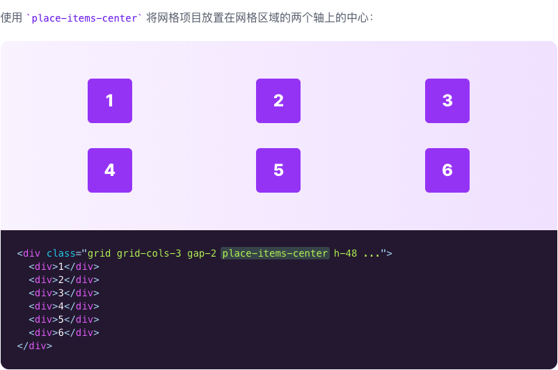
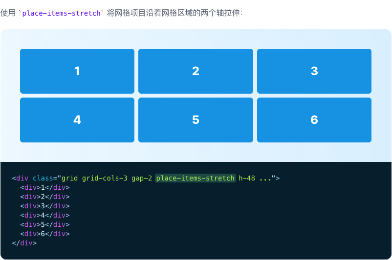

# Place Items

::: tip
用于同时控制项目如何在水平和垂直方向对齐的功能类。
:::

| Class | Properties |
| :------ | :------ |
| place-items-auto | place-items: auto; |
| place-items-start | place-items: start; |
| place-items-end | place-items: end; |
| place-items-center | place-items: center; |
| place-items-stretch | place-items: stretch; |

***Auto***

***Start***

***End***

***Center***

***Stretch***

