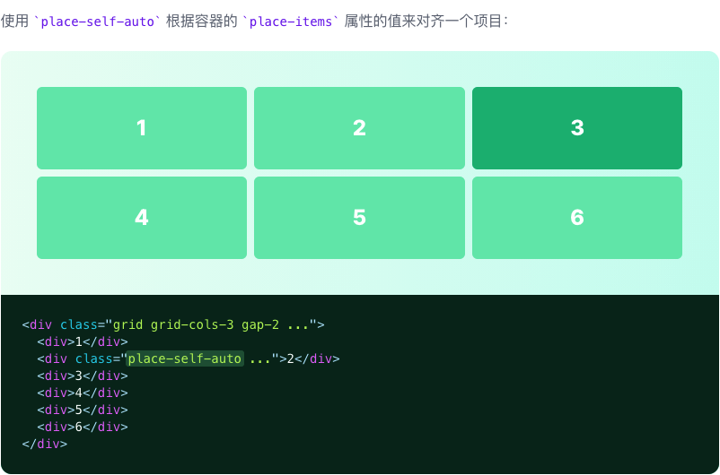
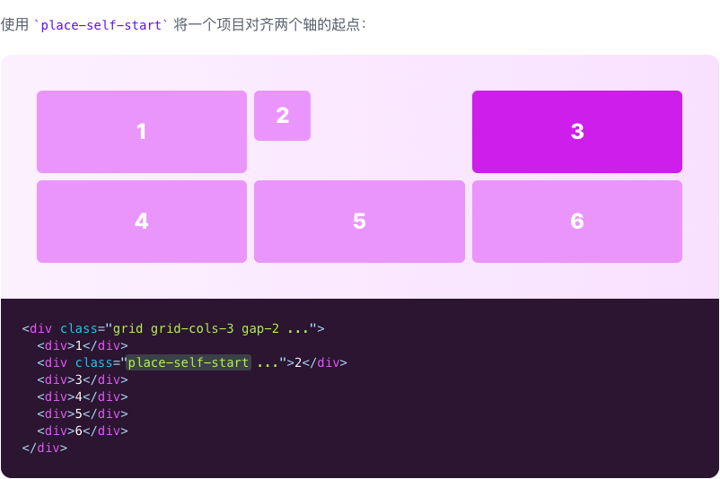
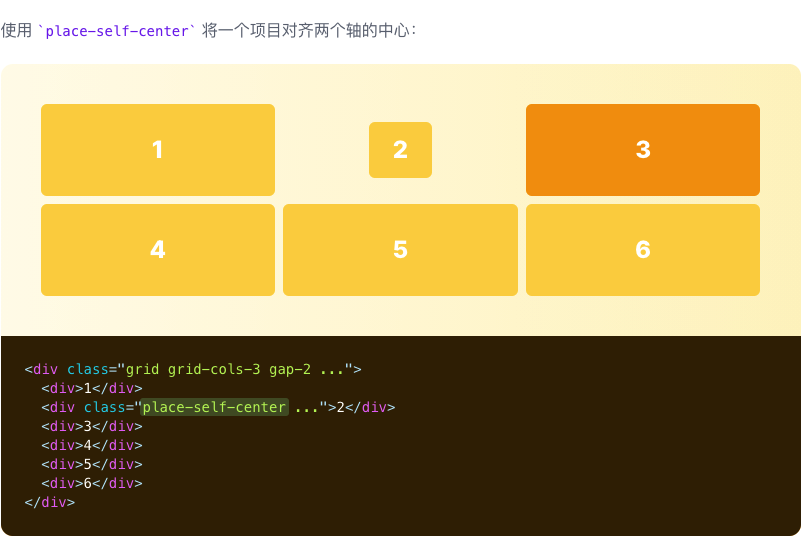
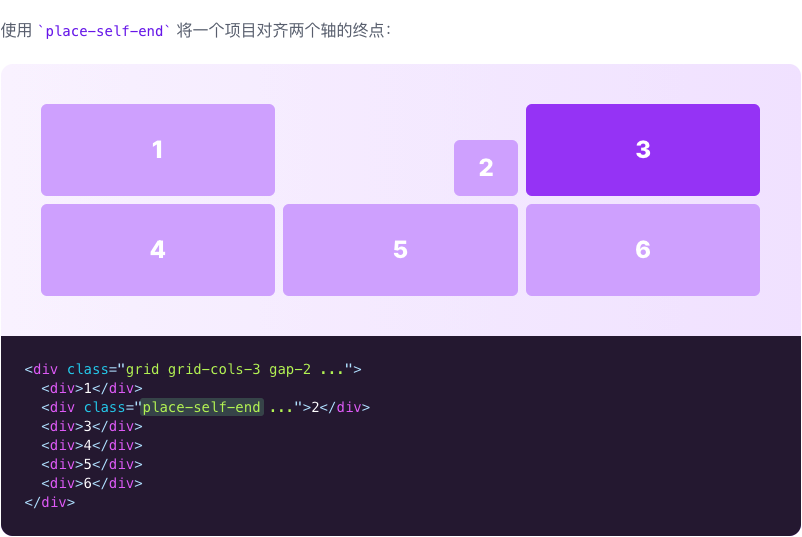
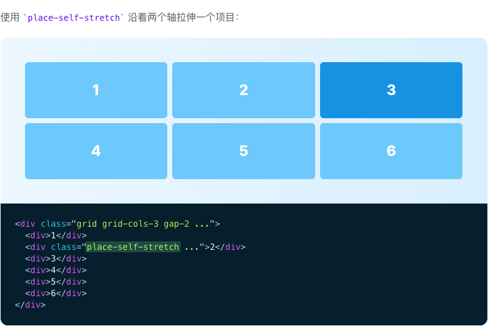

# Place Self

::: tip
用于同时控制单个项目如何在水平和垂直方向上对齐的功能类
:::

| Class | Properties |
| :------ | :------ |
| place-self-auto | place-self: auto; |
| place-self-start | place-self: start; |
| place-self-end | place-self: end; |
| place-self-center | place-self: center; |
| place-self-stretch | place-self: stretch; |

***Auto***

***Start***

***Center***

***end***

***Stretch***

