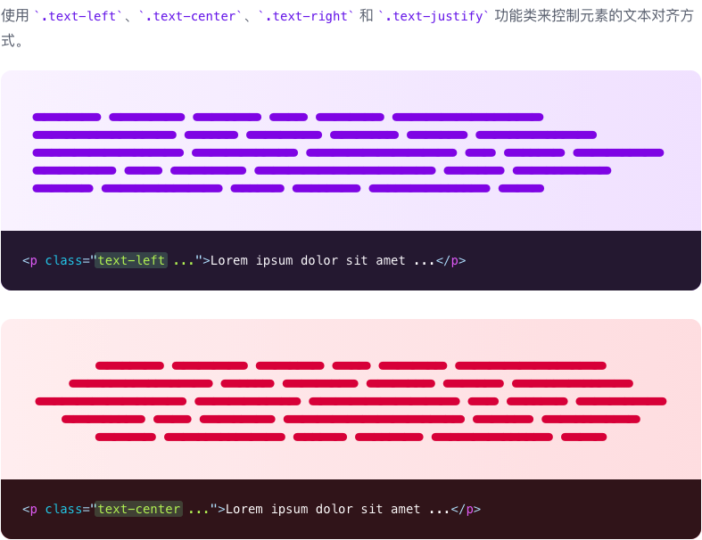
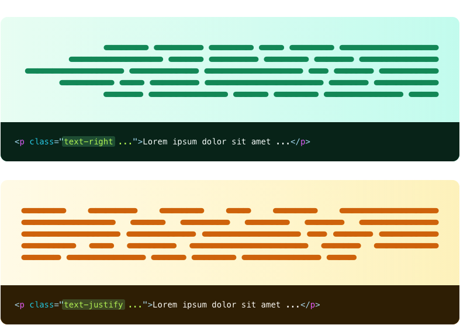

# 文本对齐

> 用来控制文本对齐的功能类。

| Class | Properties |
| :------ | :------ |
| .text-left | text-align: left; |
| .text-center | text-align: center; |
| .text-right | text-align: right; |
| .text-justify | text-align: justify; |

***使用方法***

