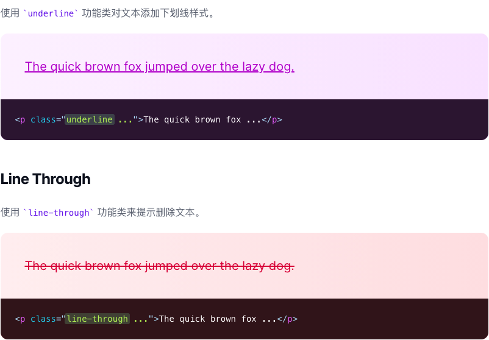
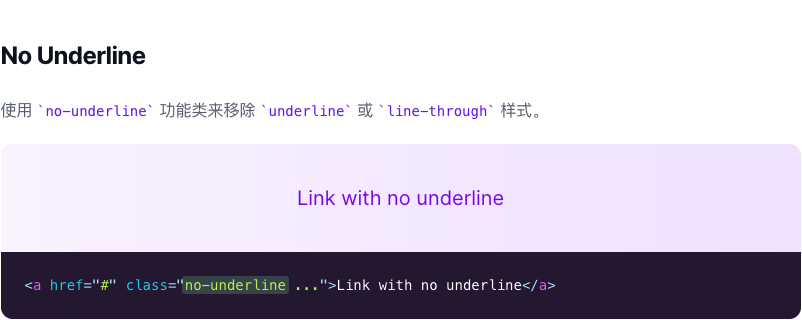

# 文本装饰

> 用于控制文本装饰的实用功能类。

| Class | Properties |
| :------ | :------ |
| .underline | text-decoration: underline; |
| .line-through	 | text-decoration: line-through; |
| .no-underline	 | text-decoration: none; |

***Underline***

