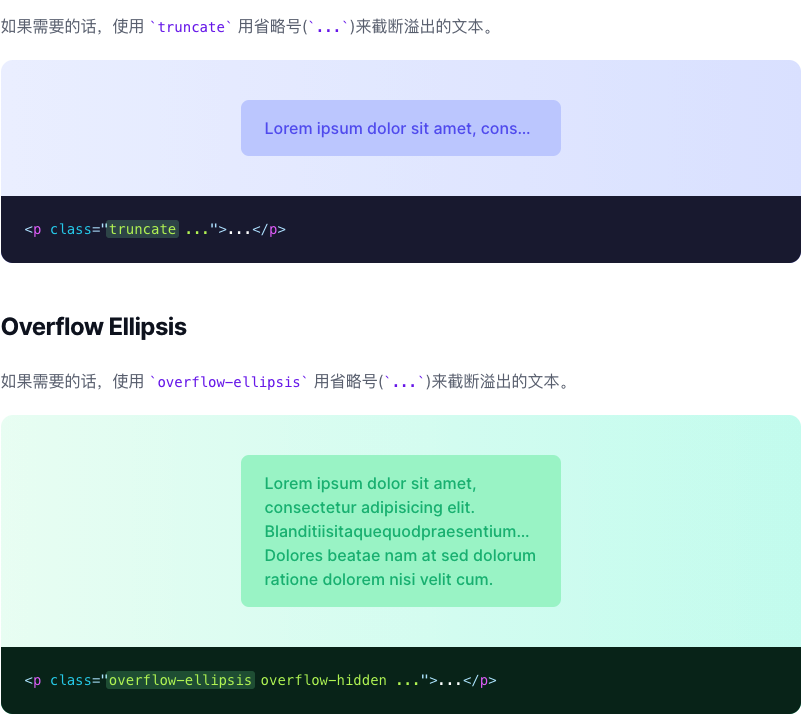
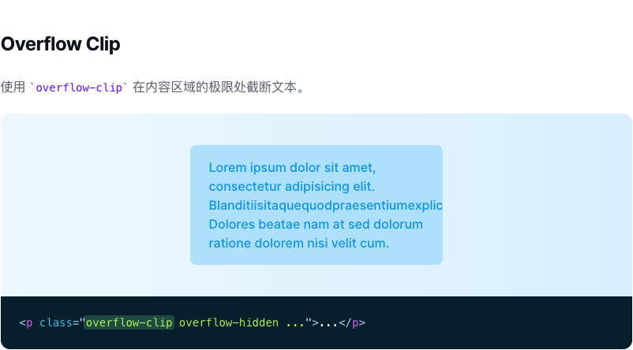

# 文本溢出

> 用于控制元素中文本溢出的功能类。

| Class | Properties |
| :------ | :------ |
| .truncate | overflow: hidden;text-overflow: ellipsis;white-space: nowrap; |
| .overflow-ellipsis		 | text-overflow: ellipsis; |
| .overflow-clip | text-overflow: clip; |

***Truncate***

