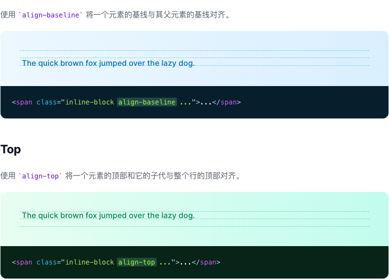
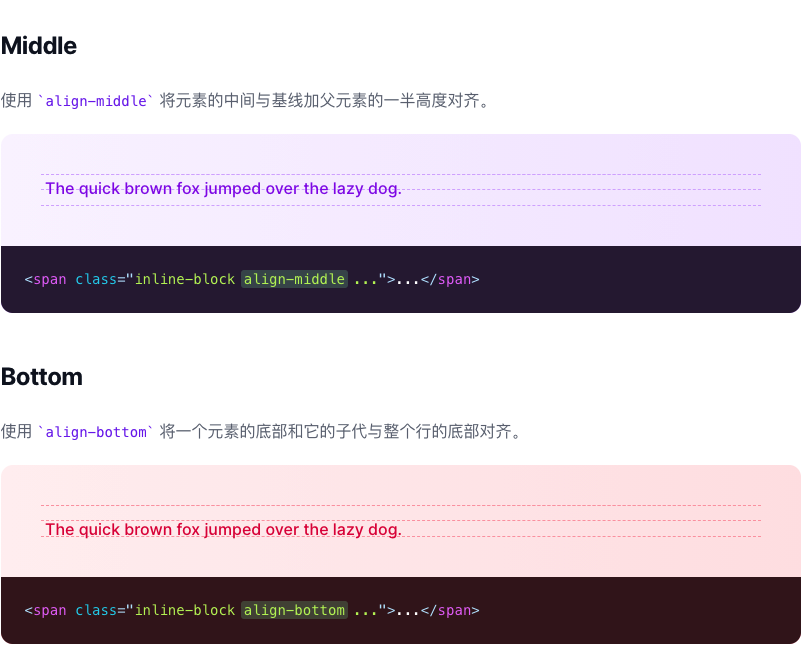
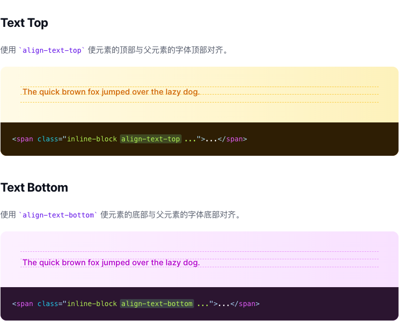

# 垂直对齐

> 用于控制内联或表格单元格的垂直对齐的功能类。

| Class | Properties |
| :------ | :------ |
| .align-baseline | vertical-align: baseline; |
| .align-top | vertical-align: top; |
| .align-middle | vertical-align: middle; |
| .align-bottom | vertical-align: bottom; |
| .align-text-top | vertical-align: text-top; |
| .align-text-bottom | vertical-align: text-bottom; |

***Baseline***

