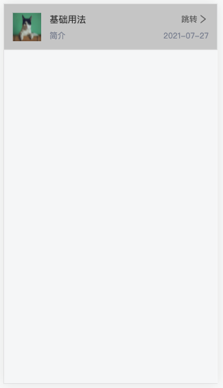

# 移动端开发文档

## 前言
凡为前端App端、小程序端、App端使用的框架为 [chameleon](http://cml.didi.cn/)

## cml文件模板
```html
<template>
  <view>
  </view>
</template>

<script>
import cml from 'chameleon-api'
import store from '../../store'
import post from '../../interface/post/index.js'

class Index {
    data = {
    }

    computed = {
      ...store.mapGetters([
        'getFontSize',
        'getUserInfo'
      ])
    }

    methods = {
      ...store.mapActions([
        'showDialog',
        'showLoading'
      ])
    }

    mounted () {}

    watch = {}

    created () {}

    beforeDestroy () {}
}

export default new Index()
</script>
<style scoped>
  @import "../../assets/less/index.less";

</style>
<script cml-type="json">
  {
    "base": {
      "usingComponents": {
      }
    }
  }
</script>
```

## 常用组件
  ```html
  <view></view>                  // 视图容器，类似 web 端的 div 块级元素标签
  <text></text>                  // 文本容器
  <image></image>                // 图片容器
  <scroller></scroller>          // 滚动容器，可滚动视图区域
  <list></list>                  // 可滚动长列表。必须配合 cell 标签显示。用于列表的展示
  <cell></cell>                  // 子列表项容器。作为<list>列表容器的子列表项。
  <input></input>                // 输入框
  <textarea></textarea>          // 多行输入框
  ```
## 常用模板语法
  [文档](http://cml.didi.cn/docs/cml.html)
  ### 数据绑定
  ```html
  // 数据绑定
  <view><text>{{ message }}</text></view>
  // 组件属性
  <view id="item-{{id}}"> </view>
  // 运算
  <view hidden="{{flag ? true : false}}"> <text>Hidden </text> </view>
  <view><text>{{a + b}} + {{c}} + d </text></view>
  <view c-if="{{length > 5}}"> </view>
  // c-model
  <input c-model="{{message}}"></input>

  class Comp {
    data = {
      message:'default-value'
    }
  }
  export default new Comp();
  ```
  ### 条件渲染
  ```html
  // 来判断是否需要渲染该代码块
  <view c-if="{{condition}}">True</view>
  // 也可以用 c-else-if 和 c-else 来添加一个 else 块
  <view c-if="{{length > 5}}"> <text>1 </text></view>
  <view c-else-if="{{length > 2}}"> <text>2 </text></view>
  <view c-else> <text>3 </text></view>
  ```
  ### 列表渲染
  ```html
  // 在组件上使用 c-for 控制属性绑定一个数组，即可使用数组中各项的数据重复渲染该组件。
  // 默认数组的当前项的下标变量名默认为 index，数组当前项的变量名默认为 item
  <view c-for="{{array}}">
    <text>{{index}}: {{item.message}}</text>
  </view>
  // 使用 c-for-item 可以指定数组当前元素的变量名， 使用 c-for-index 可以指定数组当前下标的变量名
  <view c-for="{{array}}" c-for-index="idx" c-for-item="itemName">
    <text> {{idx}}: {{itemName.message}}</text>
  </view>
  ```
  ### 事件
  ```html
  // 当用户点击该组件的时候会在该组件逻辑对象的methods中寻找相应的处理函数
  <template>
    <view id="tapTest" data-hi="WeChat" c-bind:tap="tapName">
      <text>Click me!</text>
    </view>
  </template>
  <script>
    class Index {
      methods = {
        tapName(e) {
          // 打印事件对象
          console.log('事件对象:', e);
        },
      };
    }
    export default new Index();
  </script>
  ```
  | 类型 | 触发条件 |
  | :------ | :------ |
  | click | 点击后触发 |
  | tap | 手指触摸后马上离开 |
  | touchstart | 手指触摸动作开始 |
  | touchmove | 手指触摸后移动 |
  | touchend | 手指触摸动作结束 |

## 项目的封装组件
  ### toast 提示框
  ```js
  // 引入
  import showToast from '../../interface/showToast/index.js'

  // 使用
  showToast('提示信息')
  ```
  ### dialog 弹窗
  ```js
  // 引入
  ...store.mapActions([
    'showDialog', 'showLoading'
  ])

  // 使用
  this.showDialog({
    title: '提示',                            // 弹窗标题
    content: '确认是否抢单',                   // 弹窗主要提示内容
    button: '确认',                           // 确认按钮文案
    closeButton: '取消',                      // 关闭按钮文案
    sclHeight: 80,                           // 弹窗展示区域高度
    closeFn: () => {
      // 点击关闭后出发的逻辑
    },
    confirmFn: () => {
      // 点击确认后出发的逻辑
    }
  })
  ```
  ### 按钮组件
  ```html
  <button-item size="big" text="确认" c-bind:clicked="buttonClicked" btnStyle="width:240cpx;height:80cpx;"/>
  ```
  ```js
  <script>

  class Index {

    methods = {
      buttonClicked (event) {
        console.log(event.detail)
      }
    }
  }

  export default new Index()
  </script>
  <script cml-type="json">
  {
    "base": {
      "usingComponents": {
        "button-item": "../../package/Button/index"
      }
    }
  }
  </script>
  ```
  | 参数 | 类型 | 是否必填 | 默认值 | 描述 |
  | :------ | :------ | :------ | :------ | :------ |
  | text | String | 是 | "确认" | 展现的文字 |
  | size | String | 是 | "full" | 类型：full/big/medium/small |
  | type | Number | 是 | "primary" | 类型：error/warning/default/primary/success |
  | disabled | Boolean | 否 | false | 是否禁用 |
  | btnStyle | String | 否 | - | 按钮的样式 |
  | textStyle | String | 否 | - | 文字的样式 |
  | disabledStyle | String | 否 | - | 禁用的样式 |

  ***事件回调***
  
  ```c-bind:clicked="buttonClicked"```    点击按钮时触发

  
  


  ### 手风琴组件
  ```html
  <accordion title="联系信息" height="{{88}}">
    <!-- 内容区域 -->
    <!-- <text>内容</text> -->
  </accordion>
  ```
  ```js
  <script cml-type="json">
  {
    "base": {
      "usingComponents": {
        "accordion": "../../package/Accordion/index"
      }
    }
  }
  </script>
  ```
  | 参数 | 类型 | 是否必填 | 默认值 | 描述 |
  | :------ | :------ | :------ | :------ | :------ |
  | title | String | 否 | - | 展示标题 |
  | height | Number | 是 | 0 | 设置可展开的高度 |

  
  

  ### 卡片组件
  ```html
  <card
    title="基础用法"
    items="{{list}}"
    c-bind:clicked="cardHandle">
  </card>
  ```
  ```js
  <script>

    class Index {

      methods = {
        cardHandle (event) {
          console.log(event.detail)
        }
      }
    }

    export default new Index()
  </script>
  <script cml-type="json">
  {
    "base": {
      "usingComponents": {
        "card": "../../package/Card/index"
      }
    }
  }
  </script>
  ```
  | 参数 | 类型 | 是否必填 | 默认值 | 描述 |
  | :------ | :------ | :------ | :------ | :------ |
  | title | String | 否 | - | 展示标题 |
  | items | Array | 是 | [] | 展示的数据 [{ value: 0, unit: '**', label: '**' },] |
  | icon | Boolean | 否 | true | 是否展示箭头图标 |
  | animation | Boolean | 否 | true | 是否开启动画 |


  
  

  ### 单元格组件
  ```html
  <cell-item
    title="基础用法"
    container="跳转"
    brief="简介"
    icon="{{true}}"
    imgUrl="https://img.yzcdn.cn/vant/cat.jpeg"
    cell-style="background-color: #ccc;"
    c-bind:click="cellHandle"
    icon-style="{{ iconStyle }}"
  />
  ```
  ```js
  <script>

    class Index {

      methods = {
        cellHandle (event) {
          console.log(event.detail)
        }
      }
    }

    export default new Index()
  </script>
  <script cml-type="json">
  {
    "base": {
      "usingComponents": {
        "cell-item": "../../package/CellItem/index"
      }
    }
  }
  </script>
  ```
  | 参数 | 类型 | 是否必填 | 默认值 | 描述 |
  | :------ | :------ | :------ | :------ | :------ |
  | title | String | 是 | - | 展示标题 |
  | container | String | 否 | - | 标题右侧展示的文案，一般用于展示可操作的提示文案 |
  | brief | String | 否 | - | 简介文案 |
  | concise | String | 否 | - | 简介右侧文案 |
  | imgUrl | String | 否 | - | 图片链接， |
  | icon | String | 否 | false | 是否展示container右侧的图标 |
  | cellStyle | String | 否 | - | 单元格自定义样式 |
  | iconStyle | Object | 否 | {name: '\ue855', size: 'small'} | 图标样式 |

  ***事件回调***
  
  ```c-bind:click="cellHandle"```    点击单元格时触发

  

  ### 分类组件
  ```html
  <classify-item
    title="基础用法"
    iconStyle="{{iconStyle}}"
    items="{{brandLevelItems}}"
    error="请选择"
    c-bind:clicked="classifyHandle"
  />
  ```
  ```js
  <script>

    class Index {

      methods = {
        classifyHandle (event) {
          console.log(event.detail)
        }
      }
    }

    export default new Index()
  </script>
  <script cml-type="json">
  {
    "base": {
      "usingComponents": {
        "classify-item": "../../package/ClassifyItem/index"
      }
    }
  }
  </script>
  ```
  | 参数 | 类型 | 是否必填 | 默认值 | 描述 |
  | :------ | :------ | :------ | :------ | :------ |
  | title | String | 是 | - | 展示标题 |
  | items | Array | 是 | [] | 用于分类列表的展示，[{ value: '**', placeholder: '**' }] |
  | error | String | 否 | - | 展示错误提示信息 |
  | iconStyle | Object | 否 | {name: '\ue855', size: 'small'} | 图标样式 |

  ***事件回调***
  
  ```c-bind:clicked="classifyHandle"```    点击分类时触发

  

  ### 抽屉组件
  ```html
  <drawer
    c-model="{{drawerShow}}"
    top="{{drawerStyle.top}}"
    position="{{drawerStyle.position}}"
    height="{{drawerStyle.height}}"
    buttonSlot="{{buttonSlot}}"
    c-bind:leftHandle="drawerLeftHandle"
    c-bind:rightHandle="drawerRightHandle">
    <!-- 自定义内容 -->
  </drawer>
  ```
  ```js
  

  <script>

    class Index {

      data = {
        drawerShow: false,
        drawerStyle: {
          position: 'right',
          height: 0
        },
        buttonSlot: {
          slot: true,
          leftText: '取消',
          rightText: '确认'
        }
      }

      methods = {
        drawerLeftHandle (event) {
          console.log(event.detail)
        },
        drawerRightHandle (event) {
          console.log(event.detail)
        }
      }
    }

    export default new Index()
  </script>

  <script cml-type="json">
  {
    "base": {
      "usingComponents": {
        "drawer": "../../package/Drawer/index"
      }
    }
  }
  </script>
  ```
  | 参数 | 类型 | 是否必填 | 默认值 | 描述 |
  | :------ | :------ | :------ | :------ | :------ |
  | c-model | Boolean | 是 | false | true 展示组件，false 关闭组件 |
  | title | String | 是 | - | 展示标题 |
  | height | Number | 否 | -1 | 抽屉组件内容区域展示的高度 |
  | top | Number | 否 | 88 | 抽屉组件距离顶部的高度 |
  | position | String | 否 | left | 控制抽屉组件动画方式 |
  | customStyle | String | 否 | 80% | 必须传入百分比 组件展开区域与页面总宽度的百分比 |
  | buttonSlot | Object | 否 | { slot: false, leftText: '取消', rightText: '确认'} | slot 是否展示底部按钮  leftText 左边按钮文案 rightText 右边按钮文案|

  ***事件回调***
  
  ```c-bind:leftHandle="drawerLeftHandle"```      点击左侧按钮时触发
  ```c-bind:rightHandle="drawerRightHandle"```    点击右侧按钮时触发

  

  ### 图标组件
  ```html
  <icon
    name="more_unfold"
    iconStyle="font-size: 38cpx;color:#666;"
    c-bind:clicked="iconHandle" />
  ```
  ```js
  <script>

    class Index {

      methods = {
        iconHandle (event) {
          console.log(event.detail)
        }
      }
    }

    export default new Index()
  </script>
  <script cml-type="json">
  {
    "base": {
      "usingComponents": {
        "icon": "../../package/Icon/index"
      }
    }
  }
  </script>
  ```
  | 参数 | 类型 | 是否必填 | 默认值 | 描述 |
  | :------ | :------ | :------ | :------ | :------ |
  | name | String | 是 | success | icon 的名称(注1) |
  | size | String | 否 | - | 默认: 48cpx  xs: 24cpx small: 40cpx medium: 72cpx big: 128cpx |
  | iconStyle | String | 否 | - | 自定义图标样式 |

 + 注1：icon的名称详细如下： ```{
    less, 
    more_unfold,
    back,
    more,
    add,
    subtract,
    close,
    cry,
    delete,
    help,
    refresh,
    search,
    success,
    warning,
    wrong,
    clock,
    scanning,
    filter,
    map,
    play,
    openEyes,
    closeEyes
  }```


  ***事件回调***
  
  ```c-bind:clicked="iconHandle"``` 点击图标时触发

  

  ### 输入框组件
  ```html
  <input-item
    c-model="{{value}}"
    placeholder="请输入姓名"
    title="姓名"
    error="请输入真实姓名"
    c-bind:input="inputHandle"
    c-bind:blur="blurHandle"
    c-bind:focus="focusHandle"
    c-bind:iconTap="iconTapHandle"
    c-bind:confirm="confirmHandle" >
  </input-item>
  ```
  ```js
  <script>
    
    class Index {
      data = {
        value: ''
      }

      methods = {
        inputHandle (event) {
          console.log(event.detail)
        },
        blurHandle (event) {
          console.log(event.detail)
        },
        focusHandle (event) {
          console.log(event.detail)
        },
        iconTapHandle (event) {
          console.log(event.detail)
        },
        confirmHandle (event) {
          console.log(event.detail)
        }
      }
    }

    export default new Index()
  </script>
  <script cml-type="json">
  {
    "base": {
      "usingComponents": {
        "input-item": "../../package/InputItem/index"
      }
    }
  }
  </script>
  ```
  | 参数 | 类型 | 是否必填 | 默认值 | 描述 |
  | :------ | :------ | :------ | :------ | :------ |
  | c-model | String | 是 | - | 用户输入的内容 |
  | title | String | 是 | - | 展示的标题 |
  | type | String | 否 | text | 输入框的类型（注1） |
  | placeholder | String | 否 | - | 输入框占位文字 |
  | error | String | 否 | - | 错误后提示的文字 |
  | disabled | Boolean | 否 | false | 是否禁用输入框 |
  | returnKeyType | String | 否 | done | 设置键盘右下角按钮的文字（web端不支持）（注2） |
  | icon | Boolean | 否 | false | 是否展示图标 |
  | iconStyle | Object | 否 | {name: 'success', size: 'xs', style: ''} | 自定义图标样式 |
  | isSlot | Boolean | 否 | false | 是否支持自定义输入框 |
  | maxlength | Number | 否 | 140 | 最大输入长度 |
  | minValue | Number | 否 | -Infinity | 最小值 仅对type="number"生效 |
  | maxValue | Number | 否 | Infinity | 最大值 仅对type="number"生效 |

  + 注1：输入框的类型详细如下：

  | 值 | 说明 |
  | :------ | :------ |
  | text | 文本类型的输入 |
  | password | 密码类型的输入 |
  | number | 数字类型的输入 |

  + 注2：return-key-type 的有效值详细如下：

  | 值 | 说明 |
  | :------ | :------ |
  | done | 右下角按钮为“完成” |
  | search | 右下角按钮为“搜索” |
  | next | 右下角按钮为“下一个” |
  | go | 右下角按钮为“前往” |


  ***事件回调***
  
  ```c-bind:input="inputHandle"```       输入框输入时触发

  ```c-bind:blur="blurHandle"```         输入框失焦时触发

  ```c-bind:focus="focusHandle"```       输入框获焦时触发

  ```c-bind:iconTap="iconTapHandle"```   点击图标时触发

  ```c-bind:confirm="confirmHandle"```   点击键盘完成按钮时触发


  

  ### 弹出框组件
  ```html
  <popup c-model="{{showPopup}}">
    <view class="content flex-center"><text>内容</text></view>
  </popup>
  ```
  ```js
  <script>
    
    class Index {
      data = {
        showPopup: false
      }
    }

    export default new Index()
  </script>

  <script cml-type="json">
  {
    "base": {
      "usingComponents": {
        "popup": "../../package/Popup/index"
      }
    }
  }
  </script>
  ```
  | 参数 | 类型 | 是否必填 | 默认值 | 描述 |
  | :------ | :------ | :------ | :------ | :------ |
  | c-model | Boolean | 是 | false | 是否展示弹出框 |
  | title | String | 否 | - | 展示的标题 |
  | height | Number | 否 | 500 | 弹出框的高度 |

  

  ### 搜索框组件
  ```html
  <search-bar c-model="{{value}}" c-bind:confirm="confirmHandle"></search-bar>
  ```
  ```js
  <script>
    
    class Index {
      data = {
        value: ''
      }

      methods = {
        confirmHandle (event) {
          console.log(event.detail)
        }
      }
    }

    export default new Index()
  </script>

  <script cml-type="json">
  {
    "base": {
      "usingComponents": {
        "search-bar": "../../package/SearchBar/index"
      }
    }
  }
  </script>
  ```
  | 参数 | 类型 | 是否必填 | 默认值 | 描述 |
  | :------ | :------ | :------ | :------ | :------ |
  | c-model | String | 是 | - | 输入的内容 |
  | disabled | Boolean | 否 | false | 是否禁用搜索框 |
  | returnKeyType | Number | 否 | 500 | 设置键盘右下角按钮的文字（web端不支持）（注1） |

  + 注1：return-key-type 的有效值详细如下：

  | 值 | 说明 |
  | :------ | :------ |
  | done | 右下角按钮为“完成” |
  | search | 右下角按钮为“搜索” |
  | next | 右下角按钮为“下一个” |
  | go | 右下角按钮为“前往” |

  ***事件回调***
  
  ```c-bind:confirm="confirmHandle"```       点击确认按钮时触发

  

  ### 标签栏组件
  ```html
  <tab-bar
    items="{{tabs}}"
    c-bind:change="tabHandle">
  </tab-bar>
  ```
  ```js
  <script>
    
    class Index {
      data = {
        tabs: [
          { name: '标签1', label: '标签1', disabled: false },
          { name: '标签2', label: '标签2', disabled: false }
        ]
      }

      methods = {
        tabHandle (event) {
          console.log(event.detail)
        }
      }
    }

    export default new Index()
  </script>

  <script cml-type="json">
  {
    "base": {
      "usingComponents": {
        "tab-bar": "../../package/TabBar/index"
      }
    }
  }
  </script>
  ```
  | 参数 | 类型 | 是否必填 | 默认值 | 描述 |
  | :------ | :------ | :------ | :------ | :------ |
  | items | Array | 是 | [] | 展示标签 |

  ***事件回调***
  
  ```c-bind:change="tabHandle"```       点击标签时触发

  


  ### 多行文本框组件
  ```html
  <textarea-item
    title="基本用法"
    placeholder="请输入内容"
    error="请输入内容"
    rows="{{5}}"
    height="{{280}}"
    c-model="{{value}}"/>
  ```
  ```js
  <script>

    class Index {
      data = {
        value: ''
      }

      methods = {
        inputHandle (event) {
          console.log(event.detail)
        },
        blurHandle (event) {
          console.log(event.detail)
        },
        focusHandle (event) {
          console.log(event.detail)
        },
        iconTapHandle (event) {
          console.log(event.detail)
        },
        confirmHandle (event) {
          console.log(event.detail)
        }
      }
    }

    export default new Index()
  </script>

  <script cml-type="json">
  {
    "base": {
      "usingComponents": {
        "textarea-item": "../../package/TextareaItem/index"
      }
    }
  }
  </script>
  ```
  | 参数 | 类型 | 是否必填 | 默认值 | 描述 |
  | :------ | :------ | :------ | :------ | :------ |
  | c-model | String | 是 | - | 用户输入的内容 |
  | title | String | 是 | - | 展示的标题 |
  | height | Number | 否 | 200 | 组件的展示高度 |
  | type | String | 否 | text | 输入框的类型（注1） |
  | placeholder | String | 否 | - | 输入框占位文字 |
  | rows | Number | 否 | 2 | text-area行数，weex、web端生效 |
  | error | String | 否 | - | 错误后提示的文字 |
  | disabled | Boolean | 否 | false | 是否禁用输入框 |
  | returnKeyType | String | 否 | done | 设置键盘右下角按钮的文字（web端不支持）（注2） |
  | icon | Boolean | 否 | false | 是否展示图标 |
  | iconStyle | Object | 否 | {name: 'success', size: 'xs', style: ''} | 自定义图标样式 |
  | isSlot | Boolean | 否 | false | 是否支持自定义输入框 |
  | maxlength | Number | 否 | 140 | 最大输入长度 |
  | minValue | Number | 否 | -Infinity | 最小值 仅对type="number"生效 |
  | maxValue | Number | 否 | Infinity | 最大值 仅对type="number"生效 |

  + 注1：输入框的类型详细如下：

  | 值 | 说明 |
  | :------ | :------ |
  | text | 文本类型的输入 |
  | password | 密码类型的输入 |
  | number | 数字类型的输入 |

  + 注2：return-key-type 的有效值详细如下：

  | 值 | 说明 |
  | :------ | :------ |
  | done | 右下角按钮为“完成” |
  | search | 右下角按钮为“搜索” |
  | next | 右下角按钮为“下一个” |
  | go | 右下角按钮为“前往” |


  ***事件回调***
  
  ```c-bind:input="inputHandle"```       输入框输入时触发

  ```c-bind:blur="blurHandle"```         输入框失焦时触发

  ```c-bind:focus="focusHandle"```       输入框获焦时触发

  ```c-bind:iconTap="iconTapHandle"```   点击图标时触发

  ```c-bind:confirm="confirmHandle"```   点击键盘完成按钮时触发


  

## 常用样式类名

  ### 外边距

  ```mt-1 mt-2 ... mt-10``` 从 1 到 10，元素上面的外边距

  ```mr-1 mr-2 ... mr-10``` 从 1 到 10，元素右面的外边距

  ```mb-1 mb-2 ... mb-10``` 从 1 到 10，元素下面的外边距

  ```ml-1 ml-2 ... ml-10``` 从 1 到 10，元素左面的外边距

  1代表10cpx  2代表20cpx ...  10代表100cpx

  ```html
    <view class="mt-1"></view>
    <view class="mt-2"></view>
  ```

  ### 字体大小

  ```h1 h2 ... h6``` 字体大小 1 到 6， h1字体最大、 h6最小

  ```html
    <text class="h1"></text>
    <text class="h6"></text>
  ```

  ### 边框

  ```border``` 元素加边框线，边框线样式：实线 宽度1px 色值#E6E7E8

  ```border-left``` 元素左边加边框线，边框线样式：实线 宽度1px 色值#E6E7E8

  ```border-top``` 元素上边加边框线，边框线样式：实线 宽度1px 色值#E6E7E8

  ```border-right``` 元素右边边加边框线，边框线样式：实线 宽度1px 色值#E6E7E8

  ```border-bottom``` 元素下边加边框线，边框线样式：实线 宽度1px 色值#E6E7E8

  ```html
    <view class="border"></view>
    <view class="border-left"></view>
  ```

  ### 文本居中

  ```text-align``` 使文本居中

  ```html
    <text class="text-align"></text>
  ```

  ### FlexBox布局

  ```flex-start``` 使元素内的子元素，靠左一行排列、一行展示不下换行靠左排列

  ```flex-end``` 使元素内的子元素，靠右一行排列、一行展示不下换行靠右排列

  ```flex-center``` 使元素内的子元素，居中一行排列、一行展示不下换行居中排列

  ```flex-space-around``` 使元素内的子元素，沿着容器的主轴排列，并且使每个元素两侧的距离相等

  ```flex-space-between``` 使元素内的子元素，沿着容器的主轴排列，并且使每个元素之间的距离相等

  ```html
    <view class="flex-start">
      <text>1</text>
      <text>2</text>
      <text>3</text>
    </view>
  ```

  
